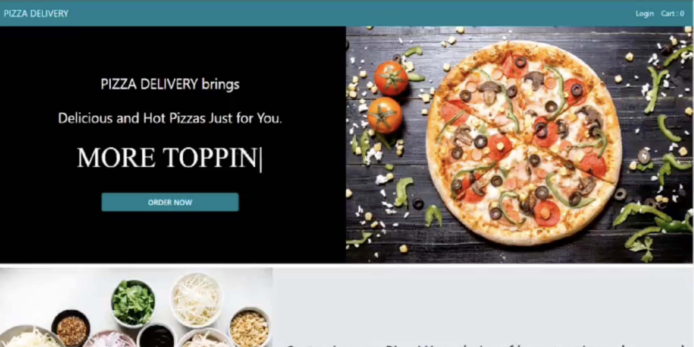

# 🍕 Pizza Delivery Application

## Overview
This **Pizza Delivery App** is a dynamic and user-friendly web application built using the **MERN Stack** (MongoDB, Express.js, React, and Node.js). The project was developed as part of my **Web Development and Designing internship at Oasis Infobyte**, where I successfully completed **Level 3 tasks** to enhance the app's functionality.

The application enables users to **customize their pizzas, place orders, and make secure online payments** using Razorpay. On the admin side, a **mini inventory management system** tracks ingredient availability in real-time, ensuring a smooth ordering process.

---

## 🚀 Features

### **User Side**
- 🍕 **Pizza Customization Flow**: Users can choose their pizza **base, sauces, cheese, and toppings** for a personalized experience.
- 🛒 **Seamless Order Placement**: Users can add multiple pizzas to their cart and place orders effortlessly.
- 💳 **Payment Integration**: Secure payment processing via **Razorpay (Test Mode)**.
- 📱 **Responsive Design**: Fully responsive UI optimized for **desktop and mobile**.

### **Admin Side**
- 📦 **Inventory Management System**: Monitors ingredient stock in **real-time**, updating inventory after each order.
- 📊 **Order Management**: Track user orders and update their status efficiently.

---

## 🛠️ Technologies Used
- **Frontend**: React.js, Redux, Tailwind CSS
- **Backend**: Node.js, Express.js
- **Database**: MongoDB, Mongoose
- **Payment Gateway**: Razorpay (Test Mode)
- **State Management**: Redux Toolkit
- **Authentication**: JWT (JSON Web Tokens)

---

## 📂 Project Structure
Pizza-Delivery-Application/ │── backend/ │ ├── controllers/ │ ├── models/ │ ├── routes/ │ ├── config/ │ ├── server.js │── frontend/ │ ├── src/ │ │ ├── components/ │ │ ├── pages/ │ │ ├── redux/ │ │ ├── App.js │ │ ├── index.js │── .env │── package.json │── README.md
